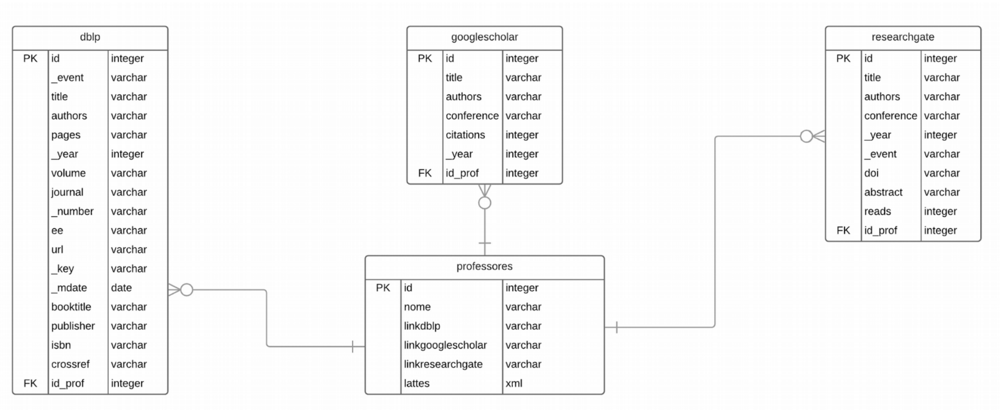

# Aluno
* 213374: Áureo Henrique e Silva Marques

# Análise do Artigo "Coleta e visualização de dados disponíveis em repositórios públicos referentes a produção científica de pesquisadores"

| campo | valor |
|------------|----------------------------------------|
| referência | BRANCO, Arthur M.; DORNELES, Carina F. Coleta e visualização de dados disponíveis em repositórios públicos referentes a produção científica de pesquisadores. XXXIV Simpósio Brasileiro de Banco de Dados: Dataset Showcase Workshop, SBBD 2021 Companion, [s. l.], 2021. |
| link       | [Acesso ao artigo](https://drive.google.com/file/d/10GJYmA6nE4aDRRmkr_dtR4MAQeFzTxuo/view) |
| dataset | [Acesso aos dados](https://github.com/arthurmbranco/CrawlerTCC/tree/master/files/data) |
| formato | Formato CSV (Tabular) |

## Resumo

O artigo aborda o tema da produção científica de pesquisadores presente em repositórios públicos. Existem muitos repositórios que armazenam esses artigos e os disponiblizam para visualização, como ACM Portal, IEEE, Elsevier, DBLP, Google Scholar e Research Gate. No entanto, esses repositórios são remotos e o autor pontua a importância da coleta de dados desses sites e sua persistência local para realização de experimentos para diversas aplicações, entre elas, análise de coautoria e desambiguação de nome de autor. Com isso, a proposta de projeto desse artigo consiste na construção de um coletor de dados que realiza a coleta de artigos e de trabalhos de três repositórios (DBLP, Google Scholar e Research Gate) e salva essas informações em um banco de dados relacional. Além disso, é desenvolvida uma interface para visualização dos dados obtidos.

Como os repositórios utilizados possuem formatos diferentes (DBLP possui formato XML e Google Scholar e Research Gate possuem formato HTML), foi necessário executar um processo de agregação dos dados e posterior conversão para o banco de dados proposto, o qual é apresentado na imagem abaixo.

O software foi desenvolvido na linguagem Java e com banco de dados PostgreSQL. Em relação a trabalhos futuros, o artigo menciona possíveis melhoras relacionadas ao refinamento na seleção dos dados escolhidos, à otimização da busca, à automatização de tarefas e à expansão do escopo dos repositórios utilizados.

## Perguntas de pesquisa/análises

* Quais os trabalhos e os artigos de um determinado professor?
*	Quais os trabalhos mais recente (por exemplo, de 2018 pra frente)?
*	Quais os trabalhos que são de uma determinada conferência ou journal?
*	Quais professores realizaram trabalhos juntos?
*	Os trabalhos de um determinado professor são recentes ou antigos?

## Trabalhos relacionados

Como mencionado no resumo, o projeto se inspira em alguns repositórios públicos: ACM Portal, IEEE, Elsevier, DBLP, Google Scholar e Research Gate.