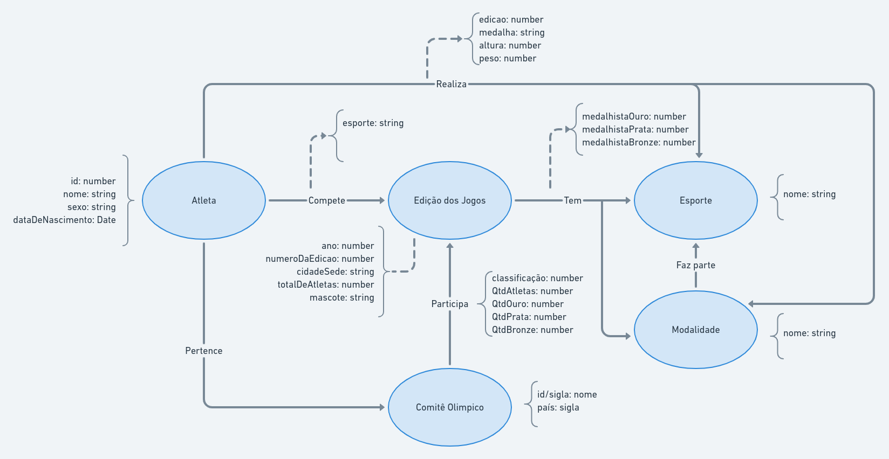

# Aluno
* 213374: Áureo Henrique e Silva Marques

## Modelo Lógico do Banco de Dados de Grafos

## Perguntas de Pesquisa/análise

* Quais todas as edições dos Jogos em que um determinado atleta participou?
* Quais todos os esportes e as modalidades de uma determinada edição dos Jogos Olímpicos? E quais as respectivas modalidades para cada esporte?
* Quais todos os atletas de um determinado comitê olímpico que ganharam pelo menos uma medalha em uma determinada edição dos Jogos?