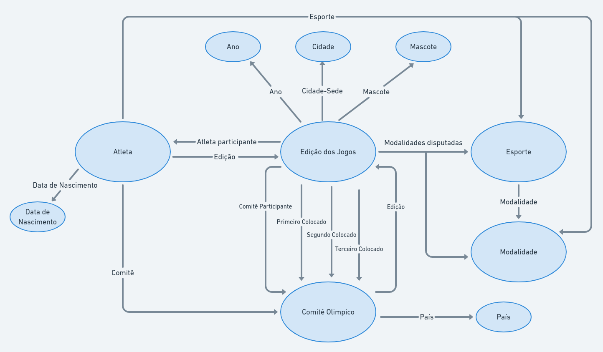

# Aluno
* 213374: Áureo Henrique e Silva Marques

## Exemplo de Grafo de Conhecimento - para publicar ou enriquecer

## Perguntas de Pesquisa ou Queries

* Para um determinado comitê olímpico, em quais edições ele ficou entre os 3 primeiros colocados?
* Quais atletas nasceram depois de 1990?
* Quais esportes que possuem mais modalidades?